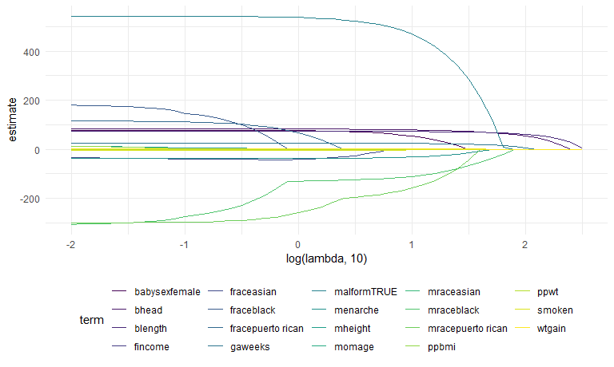
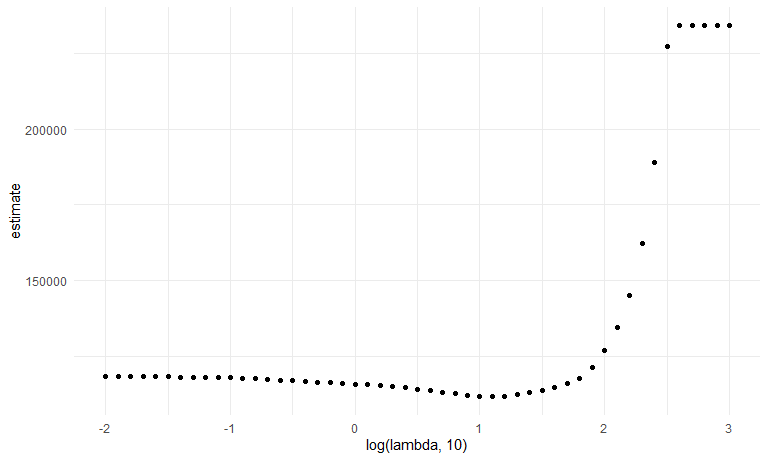
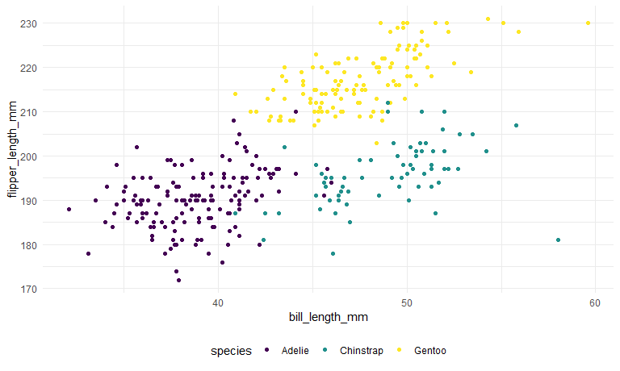
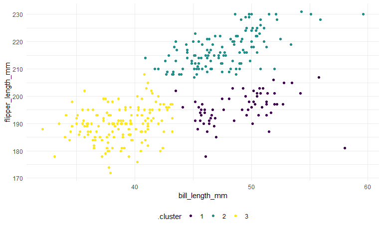

stat_learning
================
Shaolei Ma
2023-12-07

## Lasso

``` r
bwt_df = 
  read_csv("data/birthweight.csv") |> 
  janitor::clean_names() |>
  mutate(
    babysex = as.factor(babysex),
    babysex = fct_recode(babysex, "male" = "1", "female" = "2"),
    frace = as.factor(frace),
    frace = fct_recode(
      frace, "white" = "1", "black" = "2", "asian" = "3", 
      "puerto rican" = "4", "other" = "8"),
    malform = as.logical(malform),
    mrace = as.factor(mrace),
    mrace = fct_recode(
      mrace, "white" = "1", "black" = "2", "asian" = "3", 
      "puerto rican" = "4")) |> 
  sample_n(200)
```

    ## Rows: 4342 Columns: 20
    ## ── Column specification ────────────────────────────────────────────────────────
    ## Delimiter: ","
    ## dbl (20): babysex, bhead, blength, bwt, delwt, fincome, frace, gaweeks, malf...
    ## 
    ## ℹ Use `spec()` to retrieve the full column specification for this data.
    ## ℹ Specify the column types or set `show_col_types = FALSE` to quiet this message.

get predictors and outcome.

``` r
x = model.matrix(bwt ~ ., data = bwt_df)[, -1]
y = bwt_df |> pull(bwt)
```

``` r
lambda = 10 ^ (seq(3, -2, -0.1))

lasso_fit =
  glmnet(x, y, lambda = lambda)

lasso_cv =
  cv.glmnet(x, y, lambda = lambda)

lambda_opt = lasso_cv$lambda.min
```

let’s look at lasso results!

``` r
lasso_fit |> 
  broom::tidy() |>
  select(term, lambda, estimate) |> 
  filter(term != "(Intercept)") |> 
  complete(term, lambda, fill = list(estimate = 0)) |> # when it is gonna equal to 0
  ggplot(aes(x = log(lambda, 10), y = estimate, color = term, group = term)) +
  geom_path()
```



Show the CV results.

``` r
lasso_cv |> 
  broom::tidy() |> 
  ggplot(aes(x = log(lambda, 10), y = estimate)) +
  geom_point()
```



## Penguins

``` r
library(palmerpenguins)
```

    ## Warning: package 'palmerpenguins' was built under R version 4.3.2

``` r
data("penguins")

penguins |> 
  ggplot(aes(x = bill_length_mm, y = flipper_length_mm, color = species)) +
  geom_point()
```

    ## Warning: Removed 2 rows containing missing values (`geom_point()`).



``` r
penguins =
  penguins |> 
  select(species, bill_length_mm, flipper_length_mm) |> 
  drop_na()

kmeans_fit =
  penguins |> 
  select(-species) |> 
  scale() |> 
  kmeans(centers = 3)

penguins |> 
  broom::augment(kmeans_fit, data = _) |> 
  ggplot(aes(x = bill_length_mm, y = flipper_length_mm, color = .cluster)) +
  geom_point()
```


